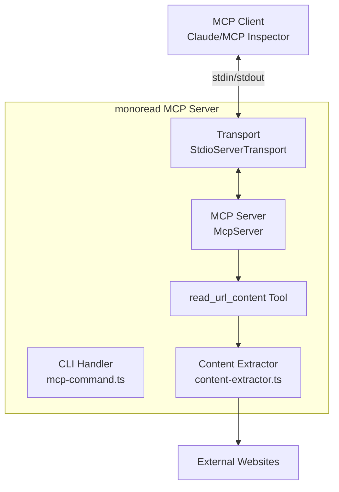

# MCPサーバ機能 設計ドキュメント

## Overview

monoreadにMCP (Model Context Protocol) サーバ機能を追加し、既存のコンテンツ抽出機能を外部アプリケーションから利用可能にする。MCPサーバは`monoread mcp`コマンドで起動し、stdin/stdout経由でMCPプロトコルに準拠した通信を行う。

## Architecture



### レイヤー構成

- **Presentation層** (`src/presentation/cli/`): MCPコマンドのCLIハンドラ
- **Presentation層** (`src/presentation/mcp/`): MCPサーバの実装
- **Usecase層** (`src/usecase/`): 既存のコンテンツ抽出ロジック（変更なし）
- **Libs層** (`src/libs/`): 共通ユーティリティ（変更なし）

## Components and Interfaces

### 1. MCPコマンドハンドラ
**ファイル**: `src/presentation/cli/mcp-command.ts`

```typescript
export const mcpCommand = define({
  name: "mcp",
  description: "Start MCP server",
  toKebab: true,
  args: globalArgs,
  run: async (ctx) => {
    // MCPサーバを起動
    await startMcpServer();
  }
});
```

### 2. MCPサーバ実装
**ファイル**: `src/presentation/mcp/server.ts`

```typescript
import { McpServer } from "@modelcontextprotocol/sdk/server/mcp.js";
import { StdioServerTransport } from "@modelcontextprotocol/sdk/server/stdio.js";

export async function startMcpServer(): Promise<void> {
  const server = new McpServer({
    name: "monoread",
    version: "1.0.0"
  });

  // read_url_contentツールを登録
  server.registerTool(
    "read_url_content",
    {
      title: "Read URL Content",
      description: "Extract content from a URL using readability",
      inputSchema: {
        url: z.string().url().describe("The URL to read content from")
      }
    },
    async ({ url }) => {
      // extractContent関数を呼び出し
      const result = await extractContent(url);
      
      if (result.success) {
        return {
          content: [{
            type: "text",
            text: result.content
          }]
        };
      } else {
        return {
          content: [{
            type: "text",
            text: `Error: ${result.error}`
          }],
          isError: true
        };
      }
    }
  );

  const transport = new StdioServerTransport();
  await server.connect(transport);
}
```

### 3. package.json更新
MCPサーバSDKの依存関係を追加：

```json
{
  "dependencies": {
    "@modelcontextprotocol/sdk": "^1.0.0",
    "zod": "^3.23.0"
  }
}
```

## Data Models

### MCPツール入力スキーマ
```typescript
{
  url: string // 有効なURL形式の文字列
}
```

### MCPツール出力フォーマット
```typescript
// 成功時
{
  content: [{
    type: "text",
    text: string // 抽出されたコンテンツ
  }]
}

// エラー時
{
  content: [{
    type: "text",
    text: string // エラーメッセージ
  }],
  isError: true
}
```

## Error Handling

### エラーケース

1. **無効なURL**
   - 入力スキーマでバリデーション（zod）
   - MCPプロトコルレベルでエラーレスポンス

2. **コンテンツ抽出失敗**
   - `extractContent`から返されるエラーをMCPレスポンスに含める
   - `isError: true`フラグを設定

3. **ネットワークエラー**
   - タイムアウトや接続エラーをキャッチ
   - 適切なエラーメッセージを返す

4. **予期しないエラー**
   - try-catchで捕捉
   - stderrにログ出力（デバッグ用）

### ログ出力戦略

- **通常動作時**: stdoutは使用しない（MCP通信専用）
- **デバッグ/エラー時**: stderrに出力
- **LOG_LEVEL環境変数**: 既存のログレベル制御を適用

## Testing Strategy

### 単体テスト

1. **MCPサーバ初期化テスト**
   - サーバが正しく起動することを確認
   - ツールが登録されることを確認

2. **read_url_contentツールテスト**
   - 正常なURLでコンテンツが抽出されることを確認
   - 無効なURLでエラーが返されることを確認
   - ネットワークエラーの処理を確認

3. **MCPプロトコル準拠テスト**
   - 初期化リクエスト/レスポンス
   - ツール一覧リクエスト/レスポンス
   - ツール実行リクエスト/レスポンス

### 統合テスト

1. **MCP Inspector互換性テスト**
   - MCP Inspectorから接続できることを確認
   - ツールが正しく表示されることを確認
   - ツール実行が成功することを確認

2. **エンドツーエンドテスト**
   - `monoread mcp`コマンドの起動
   - MCPクライアントからの接続
   - 複数のURLでのコンテンツ抽出

### テストモック

- `extractContent`関数のモック
- HTTPレスポンスのモック
- stdin/stdoutのモック

## 実装の特記事項

1. **既存コードの再利用**
   - `extractContent`関数をそのまま使用
   - ログ機能は既存の`createLogger`を使用

2. **MCP SDK依存関係**
   - `@modelcontextprotocol/sdk`パッケージを使用
   - TypeScript SDKの最新版を使用

3. **プロセス管理**
   - Ctrl+Cでグレースフルシャットダウン
   - 処理中のリクエストを完了してから終了

4. **デバッグサポート**
   - MCP Inspectorとの完全互換性
   - stderrへの詳細なログ出力（LOG_LEVEL制御）